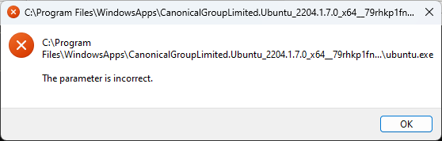
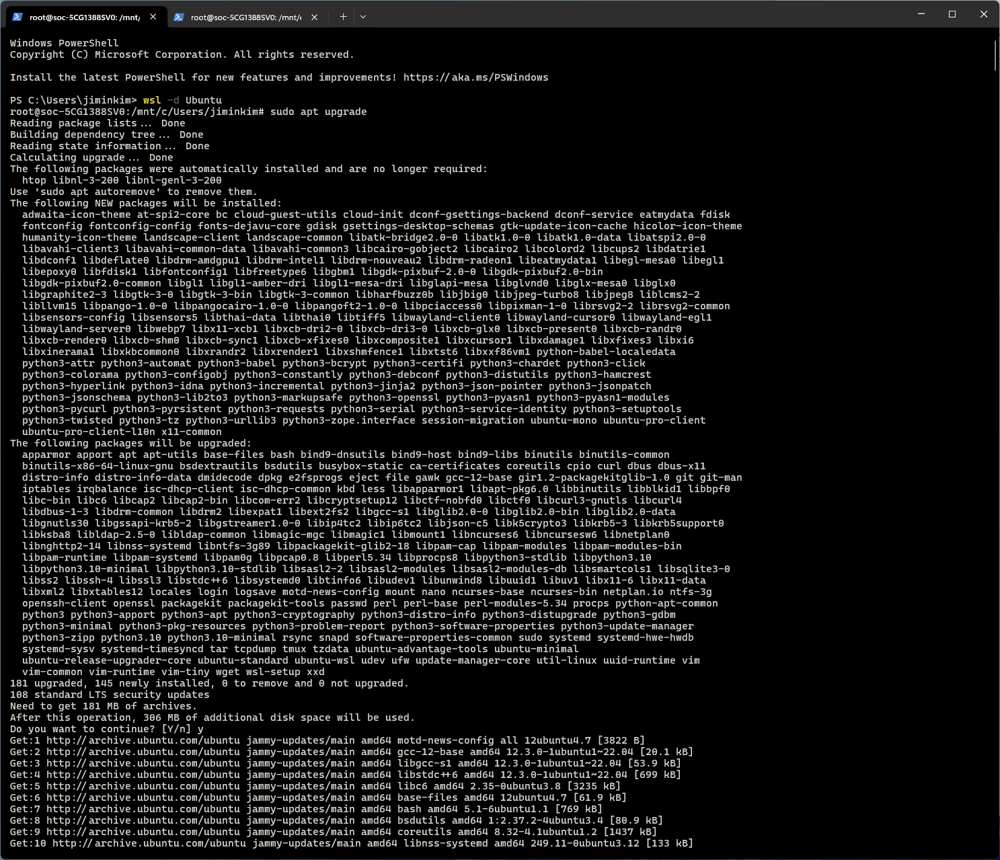
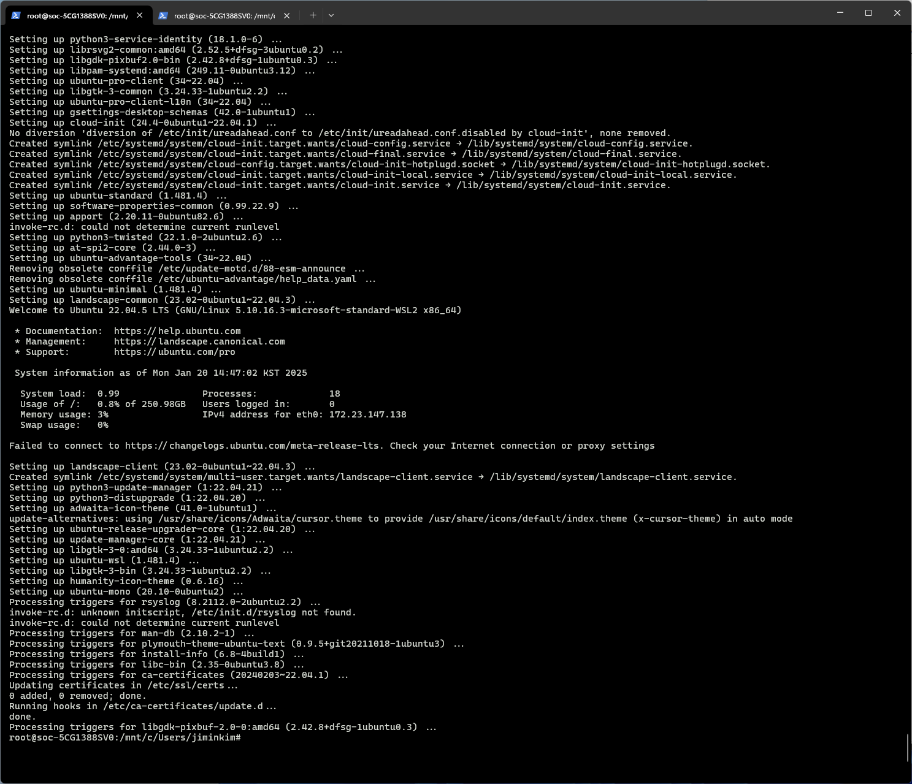

| 2025. 01. 17 | trial for installing wsl |
| --- | --- |
| 2025. 01. 20 | documenting and resolving error while installing wsl  |
|  |  |


## Installing WSL

### 1. executing Microsoft-Windows-Subsystems-Linux

```bash
dism.exe /online /enable-feature /featurename:Microsoft-Windows-Subsystems-Linux /all /norestart
```

### 2. executing VirtualMachinePlatform

```bash
dism.exe /online /enable-feature /featurename:VirtualMachinePlatform /all /norestart
```

### 3. verifying the installation with the following command

```bash
Get -WindowsOptionalFeature -Online -FeatureName Microsoft-Windows-Subsystems-Linux
```

### 4. Installing distribution with wsl

```bash
wsl --list online
```

→ the list of the distribution that can be installed was shown correctly.

```bash
wsl --install -d Ubuntu 
```

→  ERROR: “An error occurred during installation. Distribution Name : Ubuntu Error code: 0x80070057’”

→ Checked the wsl version (already applied)

```bash
wsl -set -default -version 2
```

→ Checked the Windows Update → tried to update but it repeatedly says Download error - 0x80248007  

→ tried installing with verbose mode

```bash
wsl --install -d Ubuntu --verbose
```

→ ERROR: “An error occurred during installation. Distribution Name : Ubuntu Error code: 0x80070057’”

→ Downloaded and installed Linux Kernel Update Package 

### 5. Downloading Ubuntu in Microsoft Store

→ ERROR: “Try again later. Something wrong happened on our end.”

→ Reset the Microsoft Store; Press Win + R (Resetting the Microsoft Store cache)

```bash
 wsreset.exe
```

→ ERROR: “Try again later. Something wrong happened on our end.”

→ Downloaded appxbundle from web. and installed it. 

[Manual installation steps for older versions of WSL](https://learn.microsoft.com/en-us/windows/wsl/install-manual#downloading-distributions)

### 6. Verified installation

```bash
 wsl -l -v   
```

→ Windows Subsystem for Linux has no installed distributions.                                                             Distributions can be installed by visiting the Microsoft Store:                                                         [https://aka.ms/wslstore](https://aka.ms/wslstore) 

→ tried to reinstall Ubuntu 

```bash
wsl --install -d Ubuntu 
```

→ “Ubuntu is already installed.”

Launching Ubuntu…    



C:\Users\jiminkim\AppData\Local\Packages\CanonicalGroupLimited.Ubuntu_79rhkp1fndgsc\AppData

→ the folder is newly created but the sub directories of it are all empty. 

→ when I searched about it, it said it’s because Ubuntu is not registered, even though it’s installed. 

→ tried using 

```bash
 Add-AppxPackage Ubuntu2204-221101.AppxBundle 
```

→ nothing changed. 

→ tried to register the distro with wsl —import 

```bash
wsl --import Ubuntu C:\WSL\Ubuntu C:\Users\jiminkim\AppData\Local\Packages\CanonicalGroupLimited.Ubuntu_79rhkp1fndgsc  
```

→ ERROR: Access is denied.

```bash
takeown /f "C:\WSLTemp" /r /d y
```

takeown: window command for granting access to the directory 

[takeown](https://learn.microsoft.com/en-us/windows-server/administration/windows-commands/takeown)

r: recursively

d: suppressing the prompts asking whether applying to the directory or not. y: yes. 

→ SUCCESS

```bash
~~icacls "C:\WSLTemp" /grant Everyone:(F) /t~~
icacls "C:\WSLTemp" /grant Everyone:F /t
```

acl: access control list 

[icacls](https://learn.microsoft.com/en-us/windows-server/administration/windows-commands/icacls)

when adding a single grant : do not use () around the granting option.

C:\Program Files\WindowsApps\CanonicalGroupLimited.Ubuntu_2204.1.7.0_x64__79rhkp1fndgsc

→ SUCCESS 

```bash
wsl --import Ubuntu C:\WSL\Ubuntu C:\Users\jiminkim\AppData\Local\Packages\CanonicalGroupLimited.Ubuntu_79rhkp1fndgsc  
```

→ ERROR: Access is denied. 

→  Get-AppxPackage -Name *Ubuntu*   

→  C:\Program Files\WindowsApps\CanonicalGroupLimited.Ubuntu_2204.1.7.0_x64__79rhkp1fndgsc

```bash
wsl --import Ubuntu C:\WSLTemp  "C:\Program Files\WindowsApps\CanonicalGroupLimited.Ubuntu_2204.1.7.0_x64__79rhkp1fndgsc" 

takeown /f "C:\Program Files\WindowsApps\CanonicalGroupLimited.Ubuntu_2204.1.7.0_x64__79rhkp1fndgsc" /r /d y
icacls "C:\Program Files\WindowsApps\CanonicalGroupLimited.Ubuntu_2204.1.7.0_x64__79rhkp1fndgsc"  /grant Everyone:F /t

 
```

→ Didn’t work either. 

 I have tried to move the files inside the tar file but it said ‘access denied’ error even though I have given the full accesss to the directory with the commands above. and I have tried creating a new folder in Program Files, named ‘Ubuntu_0120’ and moving the files to the path but it was same. 

→ The problem was that I should have handle the [install.tar.g](http://install.tar.gw)z file but I just used the parent directory of it. 

→ modified the command for it. 

```bash
wsl --import Ubuntu C:\WSLTemp  "C:\Program Files\WindowsApps\CanonicalGroupLimited.Ubuntu_2204.1.7.0_x64__79rhkp1fndgsc\install.tar.gz”
```

→ then verified if the ubuntu distro is available (successfully registered or not)

```bash
wsl -l -v
```

→   NAME      STATE           VERSION                                                                                                                                                                    * Ubuntu    Stopped         2     

→ SUCCESS

→ then I moved to the directory Linux and double clicked the Ubuntu → 

→ not registered. (not installed as distribution for Windows Subsystem for Linux) 

→ tried opening the Ubuntu distro

```bash
 wsl -d Ubuntu 
```




